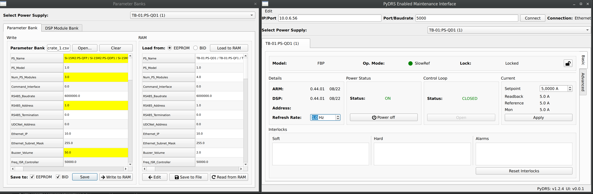

# PyDRS Enabled Maintenance Interface (PEMI)



PEMI is a basic graphical interface for PyDRS made with Qt, aiming to provide core PyDRS functionalities in an easy to navigate manner.

## Requirements
- Python 3.6 or newer

## Usage

### Linux and Windows (no `exe` file)

#### Optional: Conda
You can create Conda environments to isolate different installations, with different specifications. You can create and activate a Conda environment before proceeding with:

```sh
conda create --name pemi
conda activate pemi
```

#### Installation
**Note:** if you have multiple versions of Python installed (on Linux, for example), use the most recent one. For example, replace `pip` with `pip3` and `python` with `python3`.

```sh
pip install .
```

#### Running

**From anywhere on the computer (recommended):**

```sh
python -m pemi.main
``` 

It is also advisable to create a shortcut on your computer with this command.

**From the PEMI folder:**

```sh
python run.py
```

### Windows (`exe` file)
**Note:** this binary file has been compiled on and for x86_64 systems. There is no guarantee that it'll work on x86_32

#### Running (when available)
- Download the compiled release
- Execute `run.exe` 

#### Building
- Install Windows build dependencies with `pip install .[windows]`
- Run `pyinstaller run.spec`
- Check if relevant files are in the `dist` folder

### Developer information

#### Environment (Conda recommended)
```sh
pip install .[dev]
```
